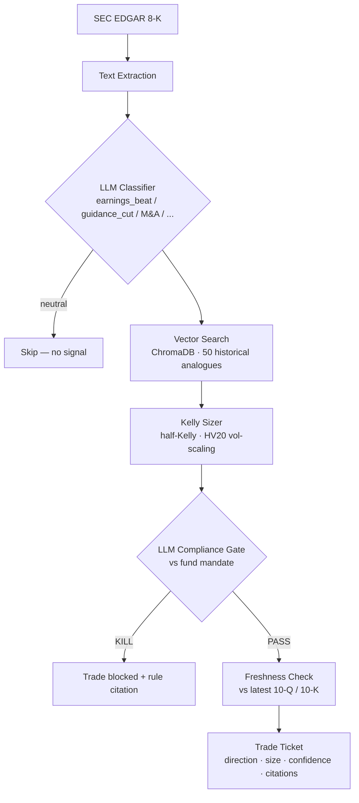

# Signal-to-Ticket

[](https://github.com/zCranking/Signal-to-Ticket-Agent/actions/workflows/test.yml)


An event-driven trade agent. When a company files an 8-K — earnings, a guidance
revision, a material event — the stock often moves 5–20% within hours, and most
of that move happens before a human has finished reading the filing. This agent
reads it first: it classifies the event, pulls historical analogues with known
price reactions, sizes a position with the Kelly criterion, runs the idea past a
fund mandate, and emits a structured trade ticket with a confidence score and a
citation trail — or kills the trade and tells you exactly which rule it broke.

The interesting part isn't any single step; it's that the agent has to *earn*
the ticket. A bullish earnings beat on a restricted ticker dies at the mandate
gate. A thesis built on stale facts gets flagged by the freshness check. Nothing
reaches the ticket stage on vibes.

## Pipeline



| Step | What happens | Powered by |
|------|--------------|-----------|
| 1. Fetch | Pull the 8-K text from SEC EDGAR | EDGAR REST API (free) |
| 2. Classify | Event type, key facts, sentiment | LLM tool use |
| 3. Analogues | Top-5 similar historical events + their 1d/5d/20d price reactions | ChromaDB + sentence-transformers |
| 4. Mandate pre-check | Load fund rules, instant restricted-ticker/sector lookup — a KILL here never reaches the LLM | Local JSON, no LLM |
| 5. Size | Half-Kelly fraction, scaled down when HV20 > 20% | yfinance + math |
| 6. Compliance gate | LLM reads the full mandate against the proposed trade — hard KILL on violations | LLM tool use |
| 7. Freshness | Are the thesis facts consistent with the latest 10-Q/10-K? | EDGAR + LLM |
| 8. Ticket | Direction, entry, stop, target, confidence, citation trail | LLM tool use |

**Steps 4 and 6 are two different gates, not one.** Step 4 is a free, instant
set-membership check — no model involved, and a kill there (e.g. a restricted
ticker) never reaches step 6 at all. Step 5 (sizing) and step 6 (the LLM gate)
simply never run. Step 6 exists for the softer judgment calls a plain lookup
can't make: sector caps, position limits, interpreting a rule against a
free-text thesis. Watch the pipeline trace in the UI — a kill on step 4 vs.
step 6 tells you which kind of rule stopped the trade.

## Quickstart

```bash
git clone https://github.com/zCranking/Signal-to-Ticket-Agent.git
cd Signal-to-Ticket-Agent
pip install -r requirements.txt

cp .env.example .env        # then fill in your LLM key (see below)

python seed.py              # one-time: load 50 historical analogues into ChromaDB
streamlit run app.py
```

Minimum `.env`:

```
LLM_PROVIDER=vultr
VULTR_API_KEY=your_key
VULTR_BASE_URL=https://api.vultrinference.com/v1/
VULTR_LLM_MODEL=deepseek-ai/DeepSeek-V4-Flash
EDGAR_USER_AGENT=your-app-name (you@example.com)
```

Any OpenAI-compatible endpoint works — set `LLM_PROVIDER=crusoe` and the
`CRUSOE_*` variables to switch providers without touching code. Embeddings run
locally (`all-MiniLM-L6-v2`), so no embedding API is needed.

## Demo mode

The sidebar ships with five pre-loaded events so the demo never depends on
EDGAR uptime or rate limits:

- **NVDA Q3 FY2025** — a clean earnings beat, the happy path end to end
- **AMD Q3 2024** — guidance cut, bearish classification
- **AMZN Q2 2024** — operating income beat with mixed revenue
- **META Q3 2024** — beats on everything, *and gets killed*: META is on the
  mandate's restricted list, so the agent blocks the trade no matter how
  bullish the signal. This is the run worth watching.
- **INTC Q2 2024** — guidance cut + dividend suspension, a -26% event

"Live ticker" mode fetches the most recent real 8-K for any ticker from EDGAR.

## Design decisions

**Half-Kelly, not full Kelly.** Full Kelly maximizes long-run growth but is
brutally sensitive to errors in the win-rate estimate — and our p_win comes
from a handful of analogues. Half-Kelly keeps ~75% of the growth rate at half
the drawdown, which is why it's the systematic-fund default. Size is further
scaled down when 20-day realized vol runs above a 20% baseline.

**Local embeddings, not an API.** At 50 analogues, a local MiniLM model
embeds a query in milliseconds with zero network dependency. An embedding API
adds latency and a failure mode for no retrieval-quality gain at this scale.

**The compliance gate is an LLM, but the pre-check isn't.** Restricted-ticker
matching is a set lookup — an LLM adds nothing but latency and risk there. The
LLM handles what actually needs judgment: sector caps, position limits, and
rule interpretation against a free-text thesis.

**Structured output with a fallback parser.** vLLM deployments vary in how
reliably they honor `tool_choice` on complex schemas. Every LLM call requests a
tool call but falls back to extracting a JSON block from raw content, so a
provider quirk degrades gracefully instead of crashing the run.

More detail in [docs/ARCHITECTURE.md](docs/ARCHITECTURE.md) and
[DECISIONS.md](DECISIONS.md).

## Documentation map

| File | What's in it |
|------|--------------|
| [docs/ARCHITECTURE.md](docs/ARCHITECTURE.md) | Full pipeline walkthrough, failure philosophy, known limitations |
| [DECISIONS.md](DECISIONS.md) | ADRs for the non-obvious technical choices, with context and consequences |
| [ROADMAP.md](ROADMAP.md) | What it would take to turn this into a real, backtested trading strategy |
| [SKILLS.md](SKILLS.md) | Task-oriented playbooks: seeding, testing, adding events, debugging |
| [CLAUDE.md](CLAUDE.md) | Context for AI coding assistants working in this repo |

## Project layout

```
signal_to_ticket/
  agent.py         # 8-step pipeline orchestrator
  classifier.py    # event classification (LLM tool use)
  compliance.py    # mandate gate (LLM + instant pre-check)
  config.py        # env + provider switching
  edgar.py         # SEC EDGAR client + filing text extraction
  retrieval.py     # analogues / mandate / freshness retrievals
  sizer.py         # half-Kelly + HV20 vol scaling
  ticket.py        # trade ticket generation (LLM)
  vector_store.py  # ChromaDB + local sentence-transformers
app.py             # Streamlit UI with live pipeline trace
seed.py            # one-time analogue DB seeding
data/
  mandate.json         # fund rules: restricted lists, caps, risk limits
  seed_analogues.json  # 50 historical events with measured price reactions
  demo_events.json     # pre-loaded demo filings
tests/               # unit tests (LLM + embeddings mocked)
```

## Running tests

```bash
pip install pytest
python -m pytest tests/ -v
```

The suite mocks all LLM and embedding calls — no API keys or model downloads
needed.

## What this is — and isn't — yet

This is a working demonstration of the *reasoning chain*: classification →
evidence retrieval → sizing → compliance → freshness → ticket, with every step
inspectable and every kill explained. What it is not, yet, is a validated
trading strategy — the analogue dataset is 50 hand-picked historical events
chosen for sector diversity and demo value, not a statistically tested,
survivorship-bias-free backtest. [ROADMAP.md](ROADMAP.md) lays out exactly
what that would take, starting with backtesting the core thesis against a real
historical filing corpus before any live-trading infrastructure is worth
building.

## Disclaimer

This is a research prototype. Nothing it emits is investment advice, and the
analogue dataset is a curated sample, not a survivorship-bias-free backtest.
